<div align="center">

# LifeLink KH · ជីវិត

**Blood emergencies in Cambodia are coordinated by Facebook post. This is the alternative.**

A donor-matching app that pushes a location-aware alert to compatible donors within seconds —
Flutter for donors, Next.js for hospitals, one Spring Boot + PostgreSQL API behind both.


</div>

---

## The public request board

Anyone can read it — no account, no login. Khmer is the default, because the users are Cambodian.

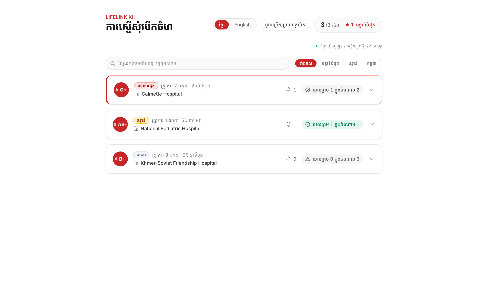

| | |
|---|---|
| 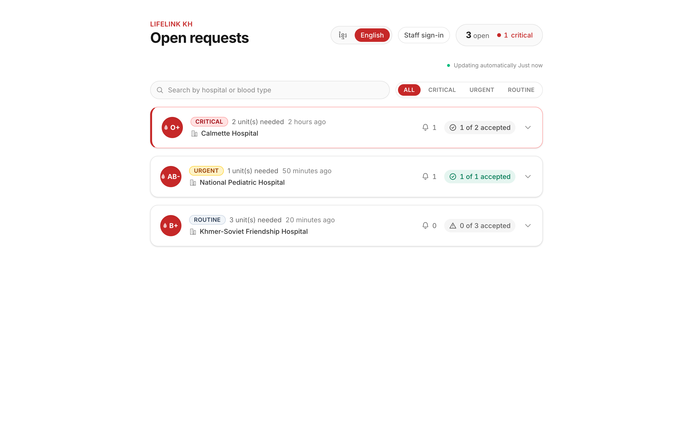 |  |
| **The same board, one tap later.** Every string in both clients ships in Khmer and English. | **The front door.** The board is one card away; the API health line proves browser → Next → Spring Boot → PostgreSQL, unmocked. |

## The hospital staff portal

The same URL, signed in. Staff get the board *plus* its actions — confirming a donation, the
recently-fulfilled list — rather than a separate screen. An `ADMIN` also gets staff management.

| | |
|---|---|
| 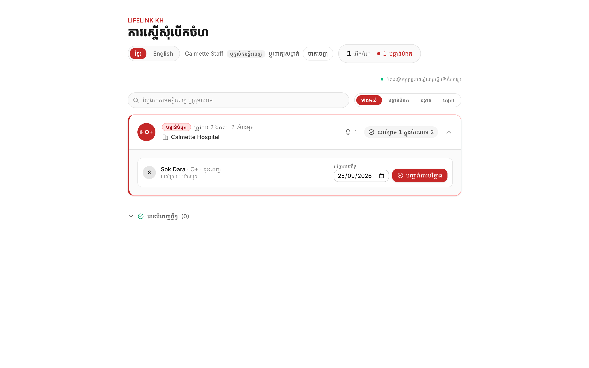 | 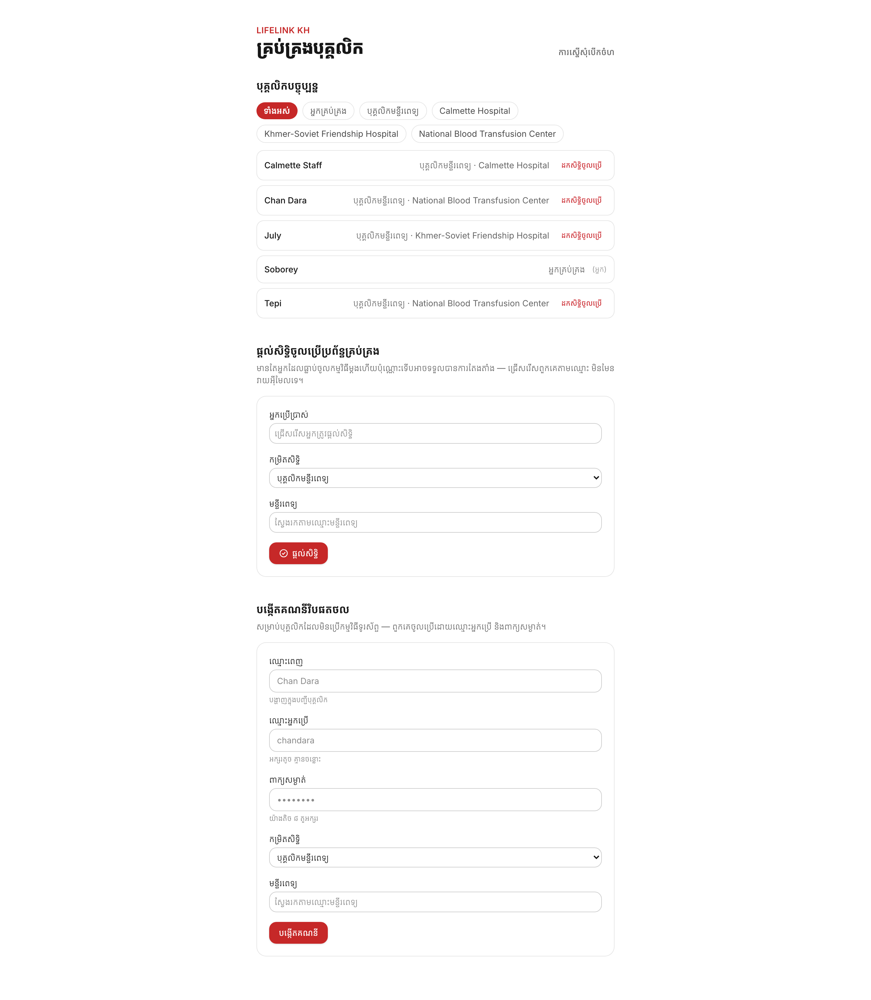 |
| **Signed in.** Same four requests, now with the confirm action and the fulfilled section. | **Staff management.** Grant portal access to someone who already signed in on the app, or create an account for someone who never will. |

## The donor app

Flutter, on the donor's phone. This is where a blood emergency actually reaches a human being.

| | |
|---|---|
| 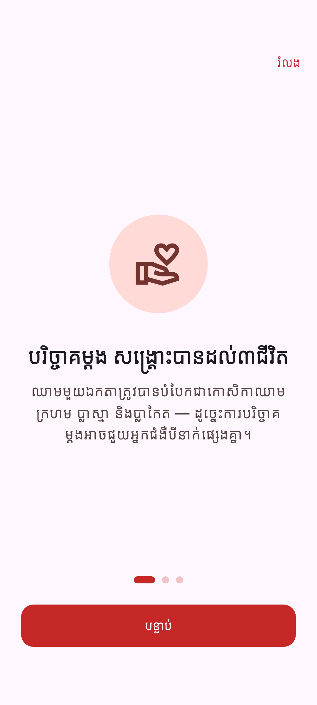 | 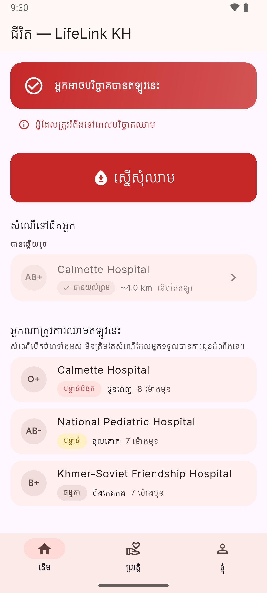 |
| **First launch explains itself.** Three slides — one donation reaching three patients, who gets alerted, the 56-day rule — skippable from the first one and never shown twice. | **Eligible, one request nearby.** Blood type, distance and how long ago it was posted. |
| 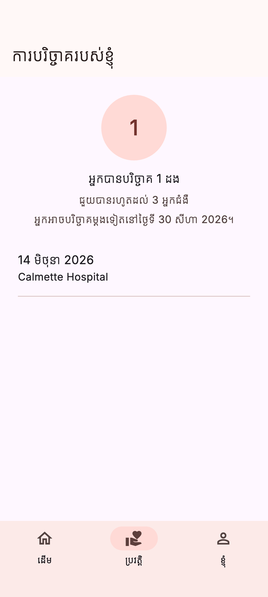 | 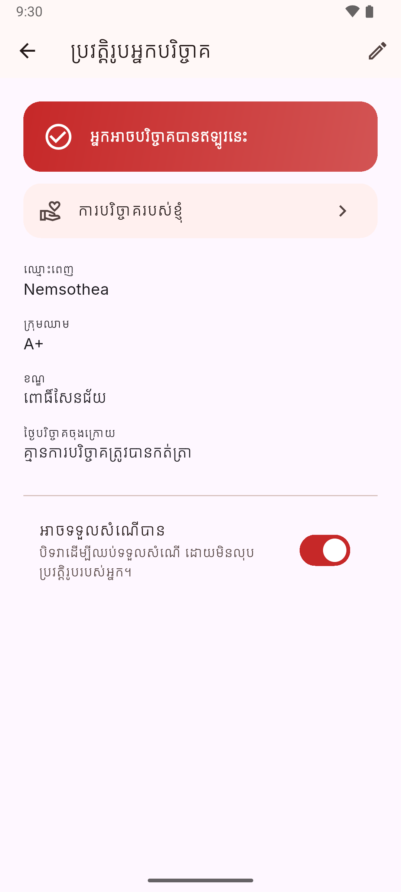 |
| **History and the 56-day cooldown**, with the date eligibility returns. | **Profile**, and the language switch that flips the whole app. |

<details>
<summary><b>The API console</b> — generated from the running code, not from a spec that drifted</summary>

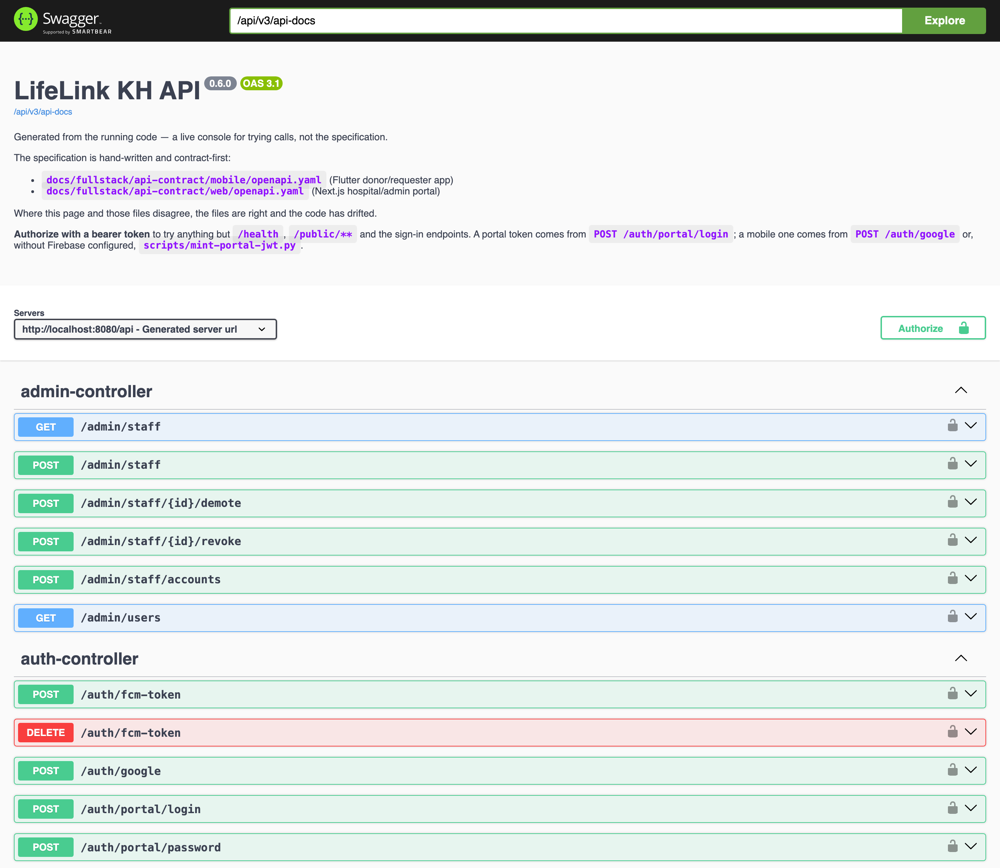

</details>

---

## The problem, stated honestly

Cambodia has chronic blood shortages. When a patient needs blood *now*, there is no systematic way
to reach compatible donors nearby — hospitals and families post to Facebook and hope. A post reaches
whoever happens to be scrolling; it cannot filter by blood type, it cannot filter by distance, and it
cannot wake a phone at 2am.

**Why an app and not a website:** a website cannot push a time-critical notification to a donor's
phone, and cannot read GPS in the background. Those two capabilities *are* the product.

## What it does

1. **Donor register** — blood type, district, last-donation date, with an automatic 56-day
   eligibility check.
2. **Urgent request broadcast** — a family or hospital posts a need; matching donors are selected by
   **ABO/Rh compatibility** (a 27-row lookup table, not a string match) and distance, then alerted by
   push.
3. **Donation history and eligibility** — the 56-day cooldown, visible, with the date a donor becomes
   eligible again.

Donors answer **offline-first**: an accept is written to SQLite and shown immediately, then synced
when signal returns. A hospital basement is exactly where this app gets used.

## Architecture

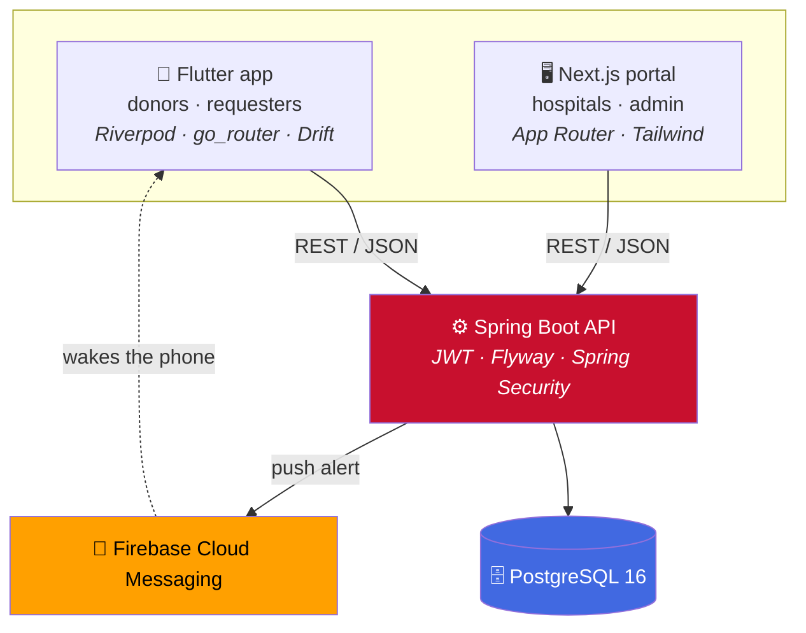

| Layer | Technology | Note |
|---|---|---|
| Mobile | Flutter → native Android | Four layers per feature, Riverpod 2.x with code generation ([ADR 0006](docs/tech-lead/adr/0006-flutter-course-architecture.md)) |
| Backend | Spring Boot · Java 21 · Flyway | JWT sessions, ASVS Level 1 baseline ([ADR 0005](docs/tech-lead/adr/0005-asvs-level-1.md)) |
| Database | PostgreSQL 16 | Schema below, migrations in `backend/src/main/resources/db/migration/` |
| Web | Next.js App Router · TypeScript · Tailwind | Hospital board + staff admin |
| Push | Firebase Cloud Messaging | Alert language follows the donor's own setting |
| Location | `geolocator`, no map widget | Coordinates satisfy GPS; a map is a week of work for no gain ([DEC-004](docs/decisions.md)) |

### Data model

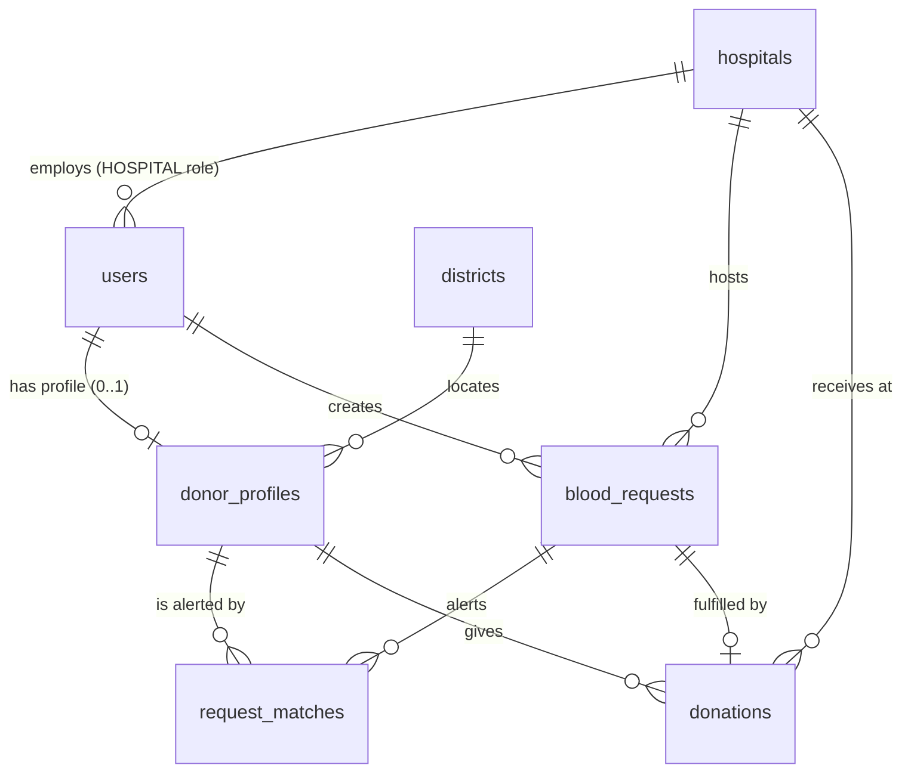

`blood_compatibility` holds 27 recipient/donor pairs and is reference data, never user input — a
28th row would mean giving somebody incompatible blood, so a test asserts the count
([ADR 0004](docs/tech-lead/adr/0004-abo-rh-compatibility-lookup-table.md)).
The full ERD with every column is in [`docs/tech-lead/data-model.md`](docs/tech-lead/data-model.md).

---

## Run it

> **Prerequisites:** Docker Desktop (Compose v2), **JDK 21**, **Node 22**, **Flutter 3.44.6**.
> Node 20 trips `EBADENGINE` — CI and both Dockerfiles pin 22.

### Supported platforms

| | Minimum | Target / built against | Where it comes from |
|---|---|---|---|
| **Android** | **API 24** (7.0 Nougat) | **API 36** (Android 16), compiled against 36 | Flutter's defaults — `build.gradle.kts` uses `flutter.minSdkVersion` / `targetSdkVersion` rather than pinning its own |
| **iOS** | **15.0** | Built with **Xcode 27** | `IPHONEOS_DEPLOYMENT_TARGET` in `Runner.xcodeproj`, plus `platform :ios, '15.0'` and a `post_install` hook that forces every pod to match |
| **Flutter** | 3.44.6 | Dart SDK `^3.12.2` | Pinned exactly in `.github/workflows/ci.yml` — never `stable`, which moves under CI |

Two things the table does not say out loud:

- **The iOS target is build-only** ([DEC-006](docs/decisions.md)). It compiles and runs on a device
  or simulator; there is no signing, no TestFlight and no App Store submission. The only store
  release in scope is Play Store internal testing.
- **The Podfile pins pods to 15.0 for a reason.** Xcode 27 rejects any deployment target outside
  15.0–27.0, and `flutter_additional_ios_build_settings` still leaves some pods at 12.0, which
  fails the build before any LifeLink code compiles. `ios/Podfile`'s `post_install` is what keeps
  that from coming back.

Verified on both: Android API 36 emulator (Google Play image), iOS Simulator 18.6 and 27.0.

```bash
cp .env.example .env       # fill it in — see the runbook. NEVER commit .env
bash scripts/dev-up.sh     # API :8080 · web :3000 · postgres :5433, all on 127.0.0.1
```

| What | Where |
|---|---|
| Web portal | http://localhost:3000 |
| API health | http://localhost:8080/api/health |
| Swagger UI | http://localhost:8080/api/swagger-ui/index.html |

```bash
# Flutter app, against the local API
cd mobile
flutter run --dart-define=API_BASE_URL=http://10.0.2.2:8080/api
```

`--dart-define=API_BASE_URL` is **required** — the app fails fast rather than falling back to a
default host. `10.0.2.2` is the Android emulator's alias for your machine.

Port 5433, not 5432: a host PostgreSQL install already owns 5432 on at least one dev machine, and
the bind fails outright ([BUG-INFRA-001](docs/qa/bugs/BUG-INFRA-001-postgres-port-5432-occupied.md)).

Use `scripts/dev-up.sh` rather than a bare `docker compose up` — it waits for health, then prints the
applied Flyway migrations, which is the evidence QA signs each milestone against.

**Full runbook, including every failure we have actually hit:**
[`docs/tech-lead/local-development.md`](docs/tech-lead/local-development.md).

### What you have to bring yourself

| Needed for | What | Without it |
|---|---|---|
| Google Sign-In, push | A Firebase project + `mobile/android/app/google-services.json` | `POST /auth/google` answers `503 AUTH_PROVIDER_UNCONFIGURED` — by design, not a bug |
| Push send | `secrets/firebase-service-account.json`, via `docker-compose.firebase.yml` | The API runs; alerts are recorded but not delivered |
| Telegram sign-in | A bot token | That auth path is inert; Google still works |

### ⚠️ Before you deploy this anywhere

Two deliberate, documented debts make this **unsafe for real donor data as it stands**:

1. **A seeded password is in the repository.** Migrations `V13`–`V16` create portal accounts, and
   since `V16` all four share one value. Rotate before anything real —
   [`docs/demo-runbook.md`](docs/demo-runbook.md) §9.
2. **Donor names on the public board are world-readable** — a deliberate override of the auth threat
   model for the pilot ([DEC-009](docs/decisions.md)), safe only because every donor row is a
   team-created test account.

Both have a recorded reason and a recorded expiry: *before any real donor's data is in this
database*. See [`docs/scope.md`](docs/scope.md).

---

## What makes this repo worth reading

The code is ordinary. **The decision record is not** — every non-obvious choice here was argued in
writing, including the ones we rejected and the ones we got wrong and reversed.

| Start here | What it holds |
|---|---|
| [`docs/decisions.md`](docs/decisions.md) | Ten decisions (DEC-001…010) with the reasoning, the alternatives, and what each one cost |
| [`docs/scope.md`](docs/scope.md) | **19 features requested, 8 built, 8 deferred — and why each cut was made.** The answer to "why isn't feature X in your app" |
| [`docs/tech-lead/adr/`](docs/tech-lead/adr/) | 8 ADRs: Google Sign-In over phone OTP, location precision, the ABO/Rh table, session lifetime, why microservices was raised and rejected |
| [`docs/security/`](docs/security/) | Threat models and security reviews, ASVS Level 1 baseline |
| [`docs/qa/`](docs/qa/) | Test strategy, and a bug registry where each entry says what the green build was hiding |
| [`docs/mobile/local-db-and-sync.md`](docs/mobile/local-db-and-sync.md) | Offline-first design: what syncs, what never leaves the server, and the conflict rule for each |
| [`docs/po/prd.md`](docs/po/prd.md) | Product requirements and acceptance criteria |
| [`docs/po/features/index.md`](docs/po/features/index.md) | Feature registry — all 19 FRs with status and milestone |

A sample of what that looks like in practice:

- **Phone OTP was replaced by Google Sign-In**, which made every donor's phone number *unverified* —
  so the risk register gained an entry, the contact card ships a visible caveat, and coordination
  moved in-app ([ADR 0002](docs/tech-lead/adr/0002-auth-google-sign-in.md)).
- **Riverpod was downgraded 3.4.2 → 2.6.x** because `riverpod_generator` cannot resolve against 3.x
  on this SDK. Code generation was the graded requirement; the runtime version was not
  ([ADR 0006](docs/tech-lead/adr/0006-flutter-course-architecture.md)).
- **`BUILD SUCCESS` is not a pass.** Testcontainers integration tests skip silently with no Docker
  daemon, so a green build once proved nothing about the schema
  ([BUG-BUILD-003](docs/qa/bugs/BUG-BUILD-003-testcontainers-skips-with-docker-running.md)).

### Testing

```bash
bash scripts/verify-all.sh   # every client, one command — the same script CI runs
```

| Client | Tests | Layers |
|---|---|---|
| Backend | 180 | JUnit 5 unit · `@WebMvcTest` slices · Testcontainers PostgreSQL integration |
| Mobile | 173 | `flutter_test` unit · widget · layout goldens |
| Web | 29 | Vitest + React Testing Library (Playwright e2e is planned, not built) |

A skipped test is not a pass. The backend's integration layer needs a running Docker daemon; without
one, 30 tests disable themselves and the build still exits 0.

---

## Repository layout

```
backend/            Spring Boot + PostgreSQL API
frontend/           Next.js web portal (hospital/admin)
mobile/             Flutter app (donors/patients)
docs/               Decisions, ADRs, specs, threat models, QA — see above
scripts/            dev-up.sh, verify-all.sh, seed helpers
docker-compose.yml  postgres + backend + web, local development only
.capybara/          Multi-role framework state
```

## Project context

Built by **Group 2** for Cross-Platform Mobile Application Development (16 weeks, Asia Euro
University). The milestone table lives in [`CLAUDE.md`](CLAUDE.md) §4 and nowhere else — a second
copy would go stale.

| Name | Role |
|---|---|
| Nem Sothea | Tech Lead / Mobile (Flutter) · also PO, Security |
| Moeun Nithvaraman | Backend / Database |
| Suon Pisey | Frontend (Next.js) |
| Sourn SAVOURN | PO |
| Oun Sreynich | QA |

Write scopes and role overlays: [`docs/team.md`](docs/team.md). New contributors start at
[`ONBOARDING.md`](ONBOARDING.md).

## License

Course project. Not licensed for production use, and **not safe for real donor data** until the two
debts above are closed.
