<div align="center">

# LifeLink KH · ជីវិត

**Blood emergencies in Cambodia are coordinated by Facebook post. This is the alternative.**

A donor-matching app that pushes a location-aware alert to compatible donors within seconds —
Flutter for donors, Next.js for the admin portal, one Firebase project (Firestore, Auth, Cloud
Functions) behind both. An admin checks every request before any donor is alerted.

**Live portal:** https://lifelinkkh.vercel.app/km · **Android app:** signed APK from the portal's
[download page](https://lifelinkkh.vercel.app/km/download) (no Play Store until 500 users).


</div>

---

## The public request board

Anyone can read it — no account, no login. Khmer is the default, because the users are Cambodian.

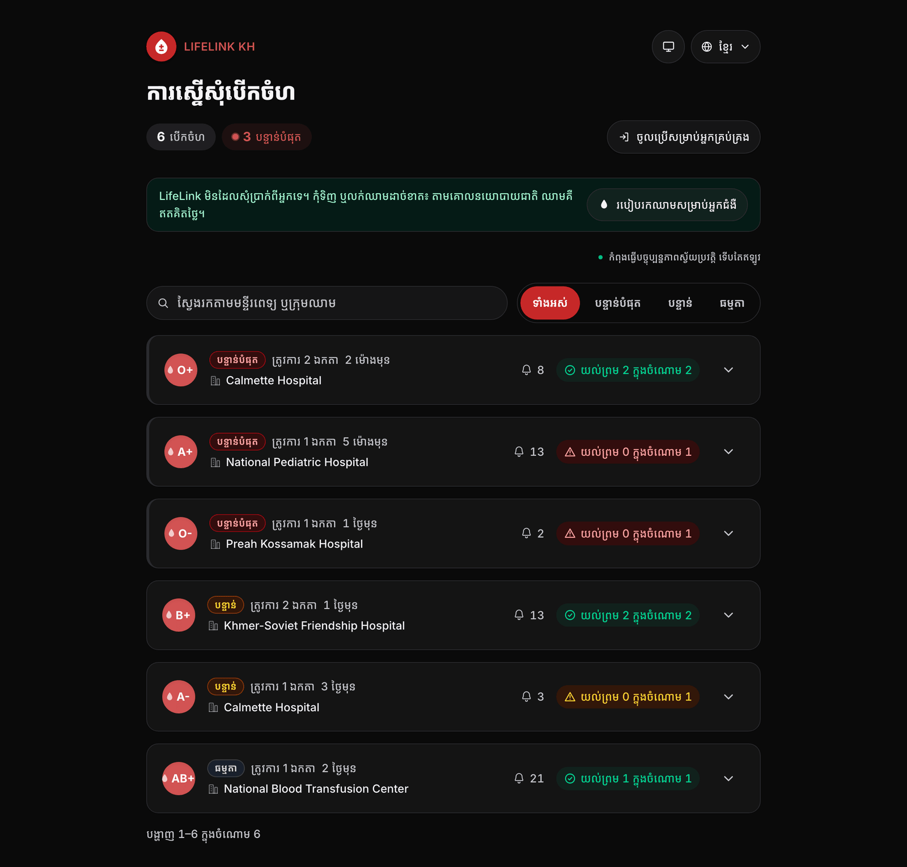

| | |
|---|---|
| 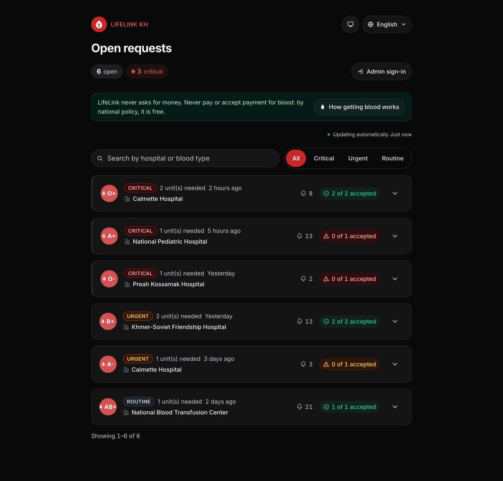 | 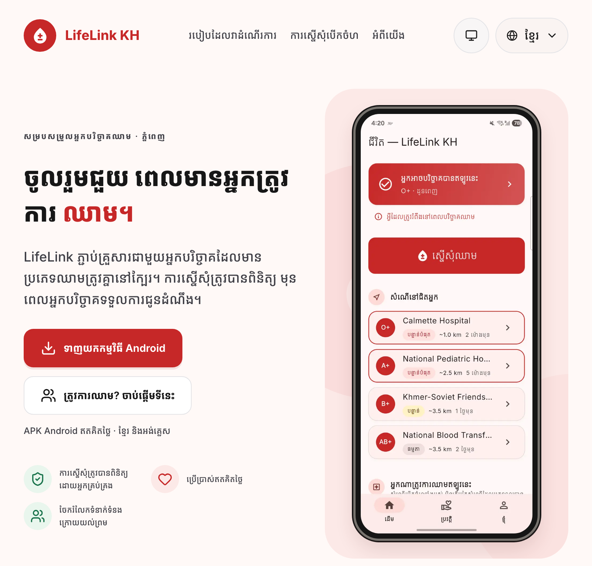 |
| **The same board, one tap later.** Every string in both clients ships in Khmer and English. | **The front door.** Get the app first, the board one card below, and the privacy and account-deletion pages. |

## The admin portal

The same URL, signed in. v1 has one portal role, `ADMIN` ([DEC-014](docs/decisions.md)), and no
hospital-staff accounts. Admins sign in with **Google** or a **username + password**
([DEC-017](docs/decisions.md)). Built on shadcn/ui, with a Light / Dark / Auto theme switch, Khmer
and English, and 44px touch targets on phones.

- **Review queue** — every new request is `PENDING` until an admin approves it (matching and
  donor alerts run then) or rejects it with a reason the requester sees
  ([DEC-015](docs/decisions.md)).
- **Requests** — open requests, confirming a donation, the recently-fulfilled list, pagination.
- **Dashboard** (`/portal/dashboard`) — the five PRD metrics plus review time for a chosen period,
  and charts: requests over time, blood-type demand vs donors, by hospital, by district. Each
  chart exports as PNG; the whole period exports as `.xlsx`.
- **Notification bell** — requests waiting for review and donations waiting for confirmation.

Public pages, no sign-in: the board, `/download` (the APK), `/privacy` (privacy policy) and
`/delete-account` (how to delete an account, [DEC-016](docs/decisions.md)).

| | |
|---|---|
| 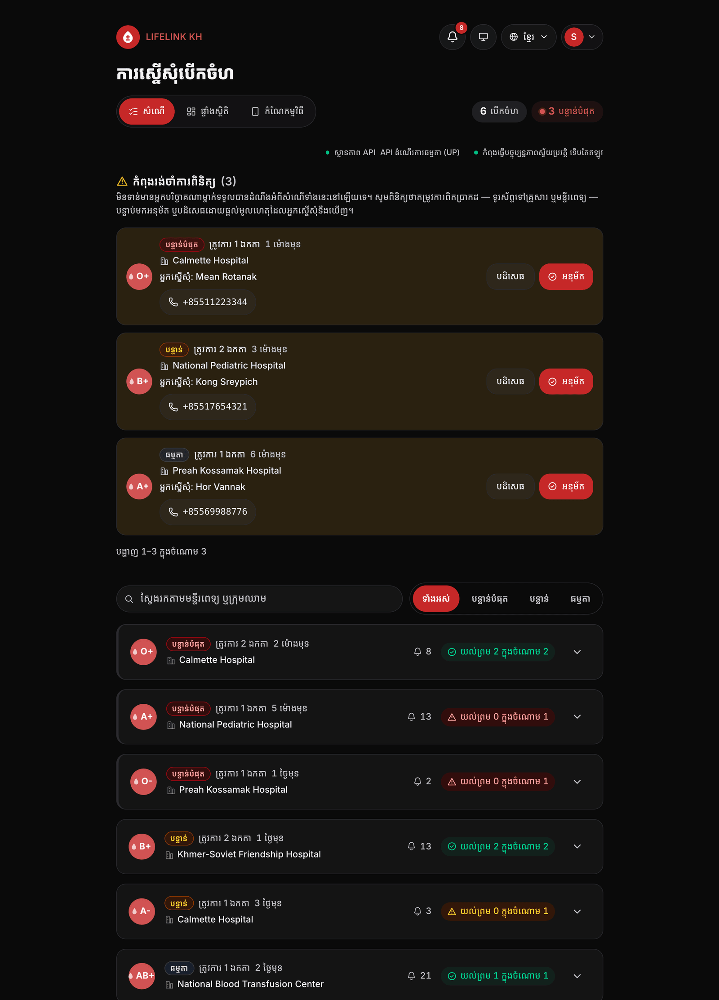 | 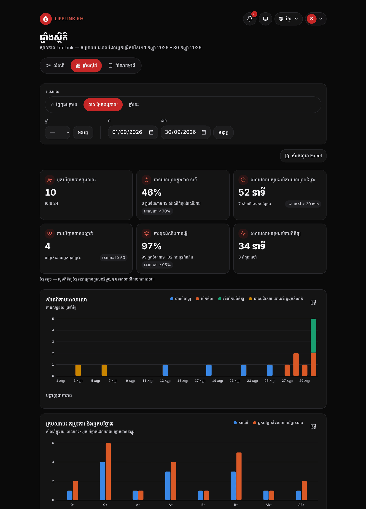 |
| **Signed in.** The review queue on top — requester, callback number, Approve / Reject — then the open requests. | **The dashboard.** PRD metrics against their targets, and the charts behind them. |

*Captured from the emulators with the demo seed (`npm run seed:demo`), so the numbers are small.*

## The donor app

Flutter, on the donor's phone. This is where a blood emergency actually reaches a human being.

| | |
|---|---|
| 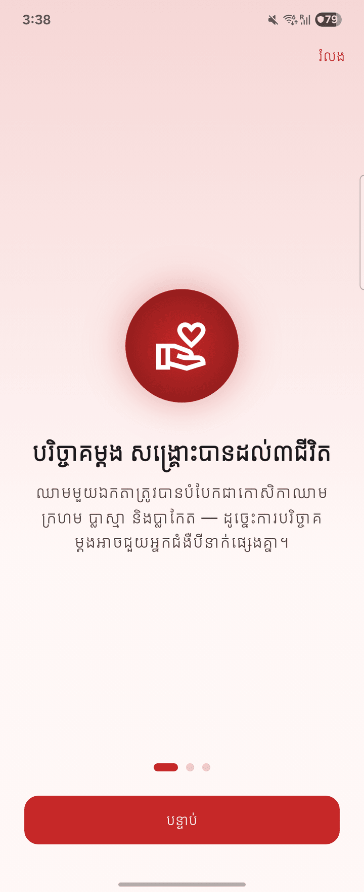 | 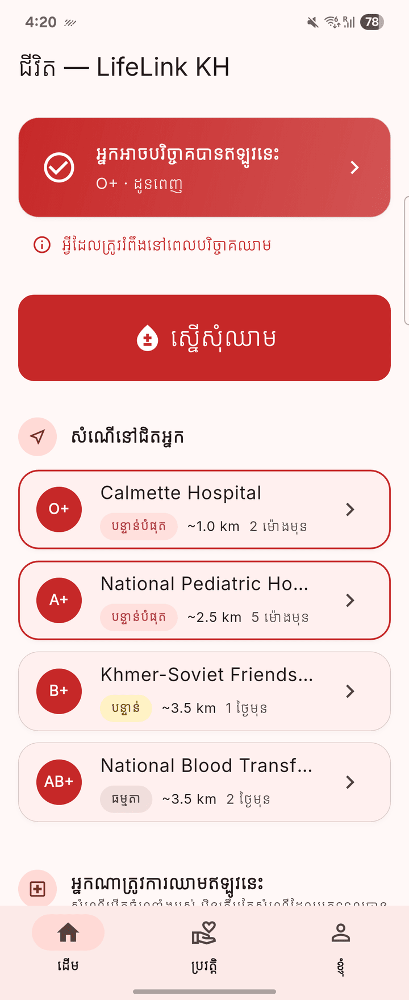 |
| **First launch explains itself.** Three slides — one donation reaching three patients, who gets alerted, the 56-day rule — skippable from the first one and never shown twice. | **Eligible, one request nearby.** Blood type, distance and how long ago it was posted. |
| 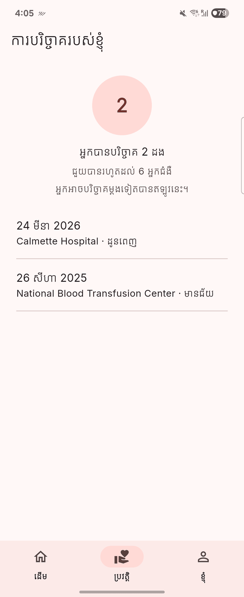 | 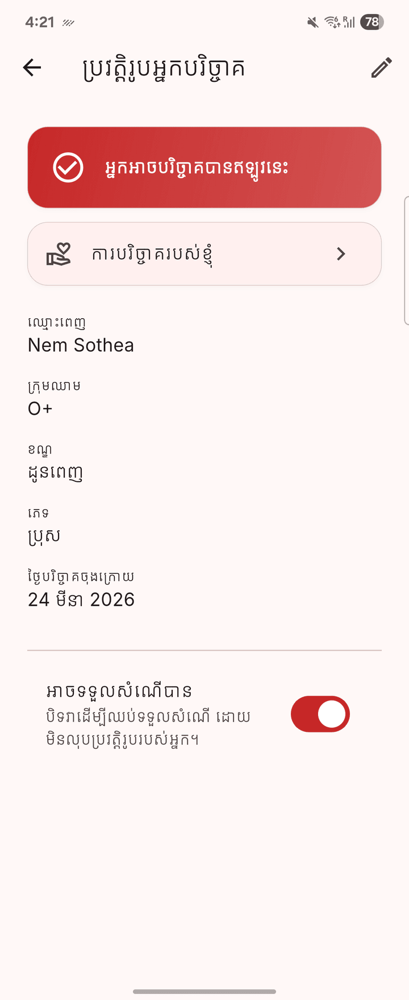 |
| **History and the 56-day cooldown**, with the date eligibility returns. | **Profile**, and the language switch that flips the whole app. |

---

## The problem, stated honestly

Cambodia has chronic blood shortages. When a patient needs blood *now*, there is no systematic way
to reach compatible donors nearby — hospitals and families post to Facebook and hope. A post reaches
whoever happens to be scrolling; it cannot filter by blood type, it cannot filter by distance, and it
cannot wake a phone at 2am.

**Why an app and not a website:** a website cannot push a time-critical notification to a donor's
phone, and cannot read GPS in the background. Those two capabilities *are* the product.

## What it does

1. **Donor register** — blood type, district, last-donation date, with an automatic 56-day
   eligibility check.
2. **Urgent request broadcast** — a family or hospital posts a need; an admin approves it; a Cloud
   Function then selects matching donors by **ABO/Rh compatibility** (a lookup table, not a string
   match) and distance, and alerts them by push.
3. **Donation history and eligibility** — the 56-day cooldown, visible, with the date a donor becomes
   eligible again.

Also in the app: **delete your account** (Me → Delete account; personal data goes, anonymous counts
stay — [DEC-016](docs/decisions.md)), a privacy policy link, and an update check that tells a
sideloaded install when a newer APK is out.

The app reads through **Firestore's offline cache**, so what a donor has already seen survives a
dead signal. A hospital basement is exactly where this app gets used.

## Architecture

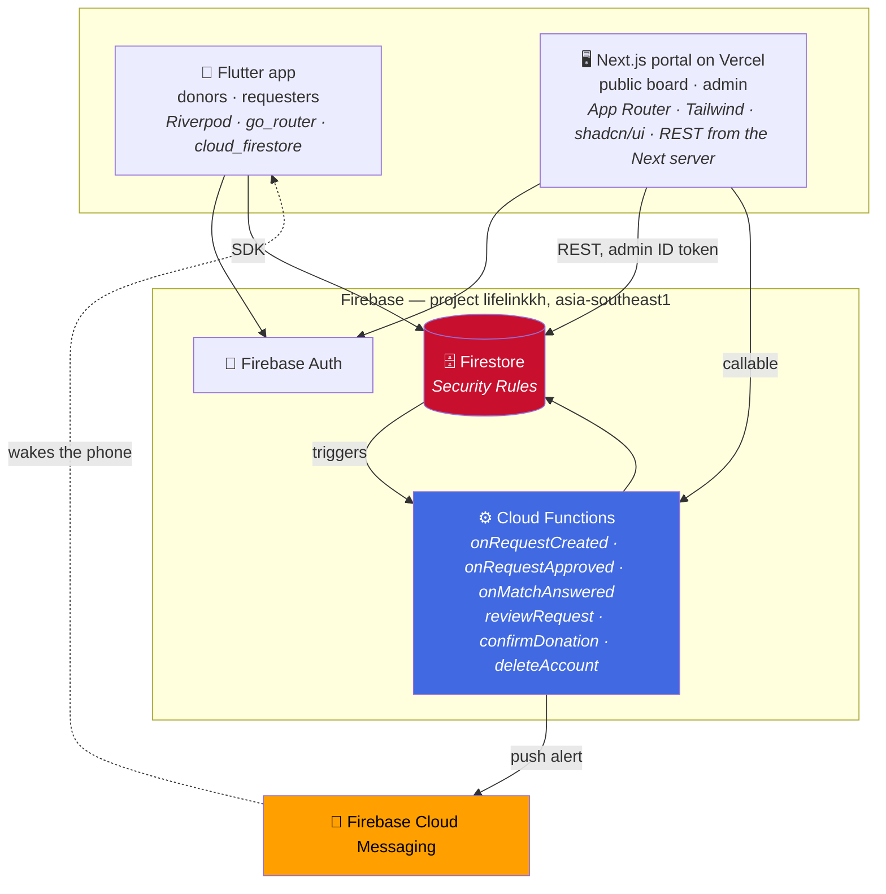
```mermaid
flowchart TB
    subgraph clients [" "]
        M["📱 Flutter app<br/>donors · requesters<br/><i>Riverpod · go_router · cloud_firestore</i>"]
        W["🖥️ Next.js portal on Vercel<br/>public board · admin<br/><i>App Router · Tailwind · shadcn/ui · REST from the Next server</i>"]
    end

    subgraph fb ["Firebase — project lifelinkkh, asia-southeast1"]
        AUTH["🔑 Firebase Auth"]
        FS[("🗄️ Firestore<br/><i>Security Rules</i>")]
        FN["⚙️ Cloud Functions<br/><i>onRequestCreated · onRequestApproved · onMatchAnswered<br/>reviewRequest · confirmDonation · deleteAccount</i>"]
    end
    FCM["🔔 Firebase Cloud Messaging"]

    M --> AUTH
    W --> AUTH
    M -->|SDK| FS
    W -->|REST, admin ID token| FS
    W -->|callable| FN
    FS -->|triggers| FN
    FN --> FS
    FN -->|push alert| FCM
    FCM -.->|wakes the phone| M

    style FS fill:#C8102E,color:#fff
    style FN fill:#4169E1,color:#fff
    style FCM fill:#FFA000,color:#000
```

There is no server of our own. The clients talk to Firebase directly, the **Security Rules**
(`firebase/firestore.rules`, one emulator test per rule) are the only thing between a client and
the data, and six **Cloud Functions** do what a client must not:

| Function | Kind | Does |
|---|---|---|
| `onRequestCreated` | trigger | Rate limit; the request waits as `PENDING` |
| `reviewRequest` | callable, admin | Approve (`OPEN`) or reject with a reason; pushes the requester |
| `onRequestApproved` | trigger | On `PENDING → OPEN`: matching, match documents, donor push |
| `onMatchAnswered` | trigger | Accepted count, public board row, "donor accepted" push |
| `confirmDonation` | callable, admin | Records the donation, starts the 56-day cooldown |
| `deleteAccount` | callable, self | Deletes personal data, anonymises counts (DEC-016) |

 Why the Spring Boot +
PostgreSQL stack was replaced: [ADR 0009](docs/tech-lead/adr/0009-firebase-replaces-spring-boot-and-postgres.md).

| Layer | Technology | Note |
|---|---|---|
| Mobile | Flutter → native Android | Four layers per feature, Riverpod 2.x with code generation ([ADR 0006](docs/tech-lead/adr/0006-flutter-course-architecture.md)) |
| Data | Cloud Firestore + Security Rules | Model and the reason behind each rule: [`firestore-data-model.md`](docs/tech-lead/firestore-data-model.md) |
| Server logic | Cloud Functions (Node 22, `asia-southeast1`) | Matching, push fan-out, donation confirmation |
| Identity | Firebase Auth | Google Sign-In in the app; Google or username + password for the portal admin (DEC-017) |
| Web | Next.js App Router · TypeScript · Tailwind · shadcn/ui | Public board, admin review queue and dashboard; talks to Firebase over REST from its own server, admin ID token in an httpOnly cookie. Hosted on Vercel (free plan, `sin1`) |
| Push | Firebase Cloud Messaging | Alert language follows the donor's own setting |
| Location | `geolocator`, no map widget | Coordinates satisfy GPS; a map is a week of work for no gain ([DEC-004](docs/decisions.md)) |

### Versions

As of 2026-09-28. The file in the last column is the source of truth — check it before trusting
this table.

| Layer | Versions | Pinned in |
|---|---|---|
| **Mobile** | Flutter **3.44.6** · Dart ^3.12.2 · flutter_riverpod 2.6 · go_router 17 · firebase_core 4 · cloud_firestore 6 · firebase_auth 6 · firebase_messaging 16 · google_sign_in 7 · geolocator 14 | `mobile/pubspec.yaml`, `.github/workflows/ci.yml` |
| **Firebase** | firebase-functions 7 · firebase-admin 14 · firebase-tools 15 · Node **22** | `firebase/functions/package.json`, `firebase/package.json` |
| **Web portal** | Next.js **15.5** · React **19.1** · TypeScript 5 · Tailwind CSS 4 · shadcn/ui (Radix) · next-intl 4 · next-themes · Node **22** | `frontend/package.json` |
| **Tooling** | Firebase Emulator Suite (Java **21**) · GitHub Actions | `firebase/firebase.json`, `.github/workflows/` |

### Data model

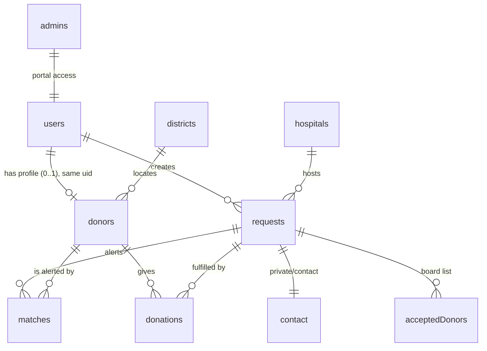
```mermaid
erDiagram
    users ||--o| donors : "has profile (0..1), same uid"
    users ||--o{ requests : "creates"
    hospitals ||--o{ requests : "hosts"
    districts ||--o{ donors : "locates"
    requests ||--|| contact : "private/contact"
    requests ||--o{ matches : "alerts"
    donors ||--o{ matches : "is alerted by"
    requests ||--o{ acceptedDonors : "board list"
    donors ||--o{ donations : "gives"
    requests ||--o{ donations : "fulfilled by"
    admins ||--|| users : "portal access"
```

The ABO/Rh compatibility table is a constant in the matching Function and reference data, never
user input — a wrong entry would mean giving somebody incompatible blood, so the unit tests pin it
([ADR 0004](docs/tech-lead/adr/0004-abo-rh-compatibility-lookup-table.md)). The requester's contact
lives in its own document because Firestore rules cannot hide a field. Every collection, and which
rule guards it: [`docs/tech-lead/firestore-data-model.md`](docs/tech-lead/firestore-data-model.md).

---

## Run it

> **Prerequisites:** **JDK 21** (the Firebase emulators), **Node 22**, **Flutter 3.44.6**.
> Node 20 trips `EBADENGINE` — CI pins 22.

### Supported platforms

| | Minimum | Target / built against | Where it comes from |
|---|---|---|---|
| **Android** | **API 24** (7.0 Nougat) | **API 36** (Android 16), compiled against 36 | Flutter's defaults — `build.gradle.kts` uses `flutter.minSdkVersion` / `targetSdkVersion` rather than pinning its own |
| **iOS** | **15.0** | Built with **Xcode 27** | `IPHONEOS_DEPLOYMENT_TARGET` in `Runner.xcodeproj`, plus `platform :ios, '15.0'` and a `post_install` hook that forces every pod to match |
| **Flutter** | 3.44.6 | Dart SDK `^3.12.2` | Pinned exactly in `.github/workflows/ci.yml` — never `stable`, which moves under CI |

Two things the table does not say out loud:

- **The iOS target is build-only** ([DEC-006](docs/decisions.md)). It compiles and runs on a device
  or simulator; there is no signing, no TestFlight and no App Store submission. The only store
  release in scope is Play Store internal testing.
- **The Podfile pins pods to 15.0 for a reason.** Xcode 27 rejects any deployment target outside
  15.0–27.0, and `flutter_additional_ios_build_settings` still leaves some pods at 12.0, which
  fails the build before any LifeLink code compiles. `ios/Podfile`'s `post_install` is what keeps
  that from coming back.

### Quick start — everything local, on the Firebase emulators

```bash
cp .env.example .env                           # NEVER commit .env

cd firebase && npm install && (cd functions && npm install)
npm run emulators:app                          # Firestore :8081 · Auth :9099 · Functions :5001 · UI :4000
```

In a second terminal:

```bash
cd firebase
npm run seed:app                                           # districts + hospitals
PORTAL_ADMIN_PASSWORD='<12+ chars>' npm run seed:admin:app # portal admin, soborey
npm run seed:demo                                          # demo donors + one matched request

cd ../frontend && npm install
FIRESTORE_EMULATOR_HOST=127.0.0.1:8081 FIREBASE_AUTH_EMULATOR_HOST=127.0.0.1:9099 \
FUNCTIONS_EMULATOR_HOST=127.0.0.1:5001 npm run dev         # portal on http://localhost:3000
```

And the app:

```bash
bash scripts/demo-mobile.sh --firestore-emulator   # Android emulator → 10.0.2.2:8081
# or: cd mobile && flutter run --dart-define=FIRESTORE_EMULATOR=10.0.2.2:8081
```

| What | Where |
|---|---|
| Web portal | http://localhost:3000 |
| Emulator UI (browse Firestore, Auth) | http://localhost:4000 |

Plain `flutter run` (no `FIRESTORE_EMULATOR`) talks to the real `lifelinkkh` project. The
emulators keep nothing across a restart, and they deliver **no pushes** — FCM has no emulator.
A new request stays `PENDING` until an admin approves it on the portal; only then are donors
matched. For real pushes, deploy to the real project:
`npx firebase deploy --only firestore,functions --project lifelinkkh` (Blaze plan).

### Production

| Piece | Where | How |
|---|---|---|
| Firebase (rules, indexes, Functions) | `lifelinkkh`, Blaze plan, $1 budget alert — target cost $0 until 500 users | [`production-checklist.md`](docs/tech-lead/production-checklist.md) Parts A–C |
| Portal | Vercel — https://lifelinkkh.vercel.app | Part D |
| Android app | Signed APK on GitHub Releases, linked from `/{locale}/download` | `bash scripts/build-release-apk.sh`, then `cd firebase && npm run release`; [`deploy-runbook.md`](docs/tech-lead/deploy-runbook.md) Path A |
| Play Store | Later — after 500 users, or sooner if M7 is graded literally | `deploy-runbook.md` Path B |

A new portal admin by Google account: have them sign in with Google once, then run
`PORTAL_ADMIN_GOOGLE_EMAIL=… npm run seed:admin -- --project lifelinkkh`. A deletion request that
came through the web link: `npm run delete-account -- --uid <uid> --project lifelinkkh`.

**Full procedure, including every failure we have actually hit:**
[`docs/tech-lead/local-development.md`](docs/tech-lead/local-development.md). The Firebase side on
its own: [`firebase/README.md`](firebase/README.md). Standing up a demo:
[`docs/demo-runbook.md`](docs/demo-runbook.md).

### What you have to bring yourself

| Needed for | What | Without it |
|---|---|---|
| Google Sign-In | `mobile/android/app/google-services.json` + this machine's debug SHA-1 in the Firebase console | The sign-in sheet returns nothing, silently |
| Real pushes, real data | The `lifelinkkh` project on the Blaze plan, Functions deployed | Use the emulators; matching still runs, pushes do not |
| Seeding / metrics on the real project | A service-account JSON in `secrets/`, via `GOOGLE_APPLICATION_CREDENTIALS` | Emulator only |
| Portal against the real project | `FIREBASE_API_KEY` (the Web API key — not a secret) | Emulator only |
| Google sign-in on the portal | `GOOGLE_CLIENT_ID` (`PORTAL_PASSWORD_SIGN_IN=off` makes Google the only way in) | Password form only |
| Signed release APK | A release keystore on this machine | `build-release-apk.sh` refuses to build |

### ⚠️ Before you deploy this anywhere

**Donor names on the public board are world-readable** — a deliberate override of the auth threat
model for the pilot ([DEC-009](docs/decisions.md)); the privacy policy says so plainly. Account
deletion (DEC-016 — in the app, and at `/{locale}/delete-account`) and the privacy policy
(`/{locale}/privacy`, English and Khmer) are built. Still open before a public launch: published
admin review hours, because a `PENDING` request alerts nobody until an admin acts
([DEC-015](docs/decisions.md)), and the rest of
[`production-checklist.md`](docs/tech-lead/production-checklist.md) Part F. See
[`docs/scope.md`](docs/scope.md).

No password is in this repository: the portal admin's comes from `PORTAL_ADMIN_PASSWORD` at seed
time and lives only in Firebase Auth ([DEC-013](docs/decisions.md)). Prefer Google sign-in for
admins ([DEC-017](docs/decisions.md)), with a Google account that is not also used to donate — the
admin claim sits on the one Firebase user, so it applies in the app too.

---

## What makes this repo worth reading

The code is ordinary. **The decision record is not** — every non-obvious choice here was argued in
writing, including the ones we rejected and the ones we got wrong and reversed.

| Start here | What it holds |
|---|---|
| [`docs/decisions.md`](docs/decisions.md) | Every decision (DEC-001…017) with the reasoning, the alternatives, and what each one cost |
| [`docs/scope.md`](docs/scope.md) | **19 features requested, 8 built, 8 deferred — and why each cut was made.** The answer to "why isn't feature X in your app" |
| [`docs/tech-lead/adr/`](docs/tech-lead/adr/) | 9 ADRs: Google Sign-In over phone OTP, location precision, the ABO/Rh table, session lifetime, why microservices was raised and rejected, and why Firebase replaced Spring Boot + PostgreSQL |
| [`docs/security/`](docs/security/) | Threat models and security reviews, ASVS Level 1 baseline |
| [`docs/qa/`](docs/qa/) | Test strategy, and a bug registry where each entry says what the green build was hiding |
| [`docs/mobile/local-db-and-sync.md`](docs/mobile/local-db-and-sync.md) | Offline-first design: what syncs, what never leaves the server, and the conflict rule for each |
| [`docs/po/prd.md`](docs/po/prd.md) | Product requirements and acceptance criteria |
| [`docs/po/features/index.md`](docs/po/features/index.md) | Feature registry — all 19 FRs with status and milestone |

A sample of what that looks like in practice:

- **Phone OTP was replaced by Google Sign-In**, which made every donor's phone number *unverified* —
  so the risk register gained an entry, the contact card ships a visible caveat, and coordination
  moved in-app ([ADR 0002](docs/tech-lead/adr/0002-auth-google-sign-in.md)).
- **Riverpod was downgraded 3.4.2 → 2.6.x** because `riverpod_generator` cannot resolve against 3.x
  on this SDK. Code generation was the graded requirement; the runtime version was not
  ([ADR 0006](docs/tech-lead/adr/0006-flutter-course-architecture.md)).
- **The server was removed, not the rules.** When Firebase replaced Spring Boot + PostgreSQL, every
  rule the API enforced in code was re-stated in the Security Rules or a Function, and each has a
  test — a rule without a test is treated as absent
  ([ADR 0009](docs/tech-lead/adr/0009-firebase-replaces-spring-boot-and-postgres.md)).

### Testing

```bash
bash scripts/verify-all.sh   # every client, one command — the same script CI runs
```

| Client | Layers |
|---|---|
| Firebase | Security Rules tests against the Firestore emulator · Functions unit tests (matching, push) · Functions emulator tests (every handler, FCM faked) |
| Mobile | `flutter_test` unit · widget · layout goldens |
| Web | Vitest + React Testing Library — 72 tests (Playwright e2e is planned, not built) |

A skipped test is not a pass. The rules and Functions emulator tests need Java 21 for the emulator.

---

## Repository layout

```
firebase/           Security Rules + tests, Cloud Functions, seed and metrics scripts
frontend/           Next.js web portal (public board, download, privacy + admin review/dashboard)
mobile/             Flutter app (donors/requesters)
docs/               Decisions, ADRs, specs, threat models, QA — see above
scripts/            verify-all.sh, demo-mobile.sh, build-release-apk.sh
.capybara/          Multi-role framework state
```

## Final defense

The slides and everything needed to run the live demo behind them:

| What | Where |
|---|---|
| **Slide deck** (15 slides, Khmer + English) | [`docs/po/presentations/LifeLinkKH-v2.pptx`](docs/po/presentations/LifeLinkKH-v2.pptx) |
| Slide deck, online — view in the browser | [Google Slides](https://docs.google.com/presentation/d/1Ah12Kzk67C7ymulHhInhS3FJemNQU3J8/edit?usp=sharing) |
| Deck source — edit this, then rebuild | [`docs/po/presentations/build_deck_v2.py`](docs/po/presentations/build_deck_v2.py) (`python3 docs/po/presentations/build_deck_v2.py`, needs `python-pptx`) |
| Run of show — 30 min of slides, 5 min of demo | [`docs/po/presentations/run-of-show.md`](docs/po/presentations/run-of-show.md) |
| Demo narration, and the day-before checklist | [`docs/po/demo-script.md`](docs/po/demo-script.md) |
| Demo commands — emulators, devices, pre-flight | [`docs/demo-runbook.md`](docs/demo-runbook.md) |
| Screenshots used by the deck and this README | [`docs/assets/screens/`](docs/assets/screens/) |

The portal admin's password is not in this repository — it is whatever `PORTAL_ADMIN_PASSWORD`
held when `npm run seed:admin` ran, or sign in with the admin's Google account ([`docs/demo-runbook.md`](docs/demo-runbook.md) §9).

## Project context

Built by **Group 2** for Cross-Platform Mobile Application Development (16 weeks, Asia Euro
University). The milestone table lives in [`CLAUDE.md`](CLAUDE.md) §4 and nowhere else — a second
copy would go stale.

| Name | Role |
|---|---|
| Nem Sothea | Tech Lead / Mobile (Flutter) · also PO, Security |
| Moeun Nithvaraman | Backend / Database (Firestore rules, Functions) |
| Suon Pisey | Frontend (Next.js) |
| Sourn SAVOURN | PO |
| Oun Sreynich | QA |

Write scopes and role overlays: [`docs/team.md`](docs/team.md). New contributors start at
[`ONBOARDING.md`](ONBOARDING.md).

## License

Course project. Not licensed for production use, and **not safe for real donor data** until the
debts above are closed.
