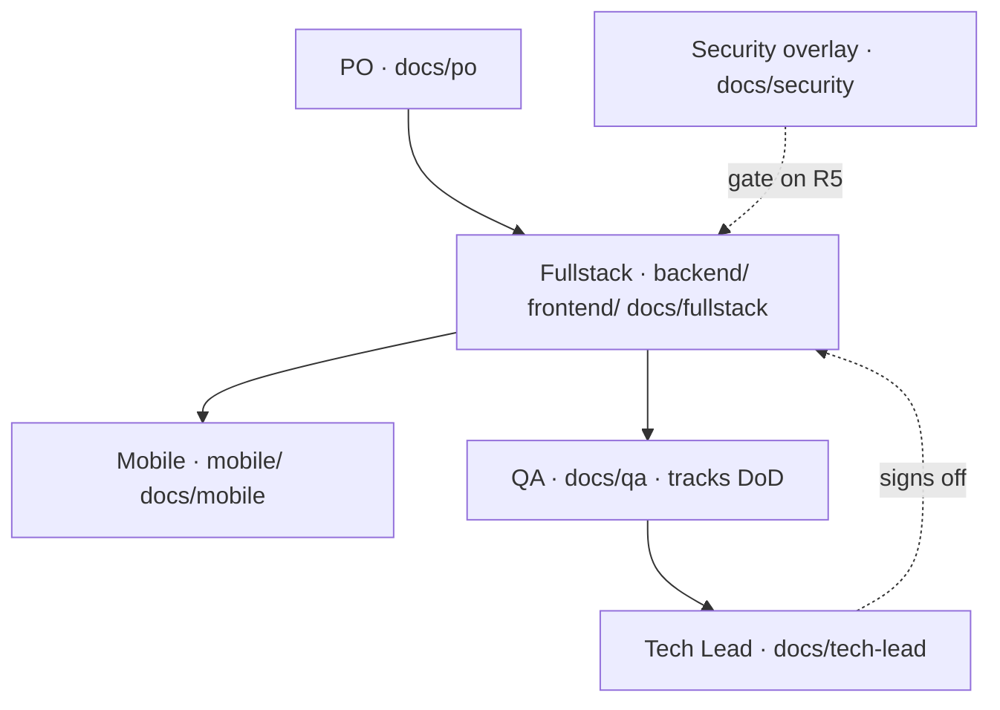

# Roles & Flows — LifeLink KH

## Ownership map

No DevOps role and no PM overlay. `docs/devops/` and `docs/pm/` remain as read-only history
(DEC-### and CR-DEVOPS records are still cited by FRs and specs).

## Feature flow
PO writes FR (docs/po/features) → Tech Lead + Security sign off spec →
Fullstack/Mobile build slice → QA verifies vs acceptance criteria →
Security sign-off (R5) → DoD met → done. Forward signal = docs/po/changelog.md.

## Infra flow
Fullstack owns `docker-compose.yml` (see docs/fullstack/specs/foundation/infra-docker.md).
Tech Lead owns CI (.github/workflows/). `infra/` is removed — no deploy runbook exists yet.

## Security flow (R5)
Any change to auth / PII / secrets / external integrations → threat model
(docs/security/threat-models) + review note (docs/security/reviews) before merge.

## Mobile flow
Flutter (mobile/) consumes the backend mobile API. API changes requested via
CR-MAPI (docs/fullstack/api-contract/mobile/change-requests.md). Mobile never
writes backend code.

## Chat ↔ docs boundary
Decisions live in docs (ADR / DEC / registries), not chat. Cross-link IDs (R7).

## Quick reference
| Want to… | Command |
|----------|---------|
| See status / next step | `/capybara-adk:status` |
| Define product / add feature | `/capybara-adk:project` |
| Spec + design an accepted FR | `/capybara-adk:plan FR-…` |
| Build a spec'd FR | `/capybara-adk:dev` |
| Review + QA + security | `/capybara-adk:review` |
| Ship | `/capybara-adk:deploy` |
