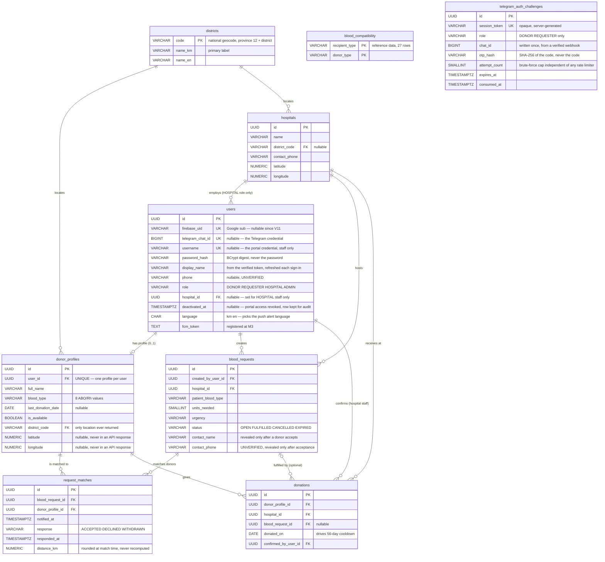

# Data Model — ERD (M1 deliverable)

The **column-level schema is not defined here.** It lives in
[`../fullstack/specs/foundation/backend-spring.md`](../fullstack/specs/foundation/backend-spring.md)
under "Initial schema — `V1__init.sql`", which Fullstack owns, plus every `V<n>` migration after it.
This document is the architecture-level view: entities, cardinality, and the decisions that shape
them. Duplicating columns here would create a second source of truth that goes stale the first time a
migration lands.

The diagram carries the columns that change how the model is *read* — credentials, foreign keys,
values another system depends on — and not every column that exists. `created_at` / `updated_at` are
on every table that has them and are omitted throughout.

> **Refreshed twice on 2026-09-06** — the second time for V13-V17, which gave `users` a third
> credential (`username` + `password_hash`, for portal staff who hold no Google or Telegram
> identity) and a way to switch an account off without deleting it (`deactivated_at`). The first
> refresh, that morning, is described below.
>
> **Refreshed 2026-09-06.** The diagram had not moved since M2 and was five migrations behind:
> `districts` (V2) and `blood_compatibility` (V1) were missing entirely, as was
> `telegram_auth_challenges` (V11); `users.hospital_id` (V8) is a real relationship to `hospitals`
> that no line represented; `firebase_uid` stopped being the sole credential in V11. An ERD that
> disagrees with the schema is worse than no ERD — it is the document people trust instead of
> reading the migrations.

## Entity relationship diagram

Two tables above carry no foreign key to anything and that is on purpose. `blood_compatibility` is
reference data — the 27 valid (recipient, donor) pairs of ADR 0004, seeded by `V1__init.sql` and
joined against at match time. `telegram_auth_challenges` holds a sign-in attempt that has, by
definition, no `users` row yet; it gains a `chat_id` from the webhook and is then consumed, and the
`users` row it produces links back through `users.telegram_chat_id`, not through a key here.

## Why the shape is this way

**`donor_profiles` is separate from `users`, not merged into it.** Requesters, hospital staff and
admins are users with no blood type, no availability and no cooldown. Merging would put six nullable
donor columns on every account and make "is this person a donor" a null check instead of a join.

**`request_matches` is a real table, not a computed list.** FR-NOTIFY-001 needs to know a push was
sent (`notified_at`), and FR-REQUEST-002 needs the donor's answer. Neither is derivable from the
request and the donor alone — the match is the thing that has state.

**`donations` is the sole source of truth for eligibility.** `donor_profiles.last_donation_date`
exists for fast filtering, but it is a cache of `MAX(donations.donated_on)`. If the two disagree, the
`donations` row wins. FR-DONOR-002's 56-day computation must not be able to disagree with the history
FR-DONATION-001 displays.

**`donations.blood_request_id` is nullable.** FR-08 allows a donation with no originating request —
someone who simply walks in. Making it required would make the app unable to record the most common
kind of donation.

**Primary keys are UUID.** Sequential IDs in API paths would let anyone enumerate donors and requests;
phone number plus blood type is exactly the data worth enumerating (`prd.md` §6).

## Amended 2026-08-07 by the auth change

`users.firebase_uid` replaces phone as the credential — see
[ADR 0002](adr/0002-auth-google-sign-in.md) and `SEC-REVIEW-001` finding F1. Consequences:

- Identity is the Google `sub` claim, written server-side from a verified ID token. Never from a
  request body.
- **`phone` is now unverified and nullable.** Anything that assumes a reachable number is wrong until
  `FR-REQUEST-002` moves coordination to FCM push.

## What the database refuses, and why it is the database that refuses it

Application validation catches a mistake in the request that made it. A constraint catches it in
every path that will ever exist — a migration, a seed script, a psql session at 2am, a second
service nobody has written yet. These are the rules that are worth that:

| Rule | Where | Why here and not only in code |
|---|---|---|
| 8 valid ABO/Rh values | `CHECK` on `donor_profiles`, `blood_requests` | A typo'd blood type is a match that never fires or one that should never have |
| 27 compatible pairs | `blood_compatibility` rows (ADR 0004) | Clinical data, reviewed as data. Not an `if` ladder in a service |
| One profile per user | `UNIQUE` on `donor_profiles.user_id` | Two profiles means two eligibility answers for one person |
| One match per (request, donor) | `UNIQUE` on `request_matches` | A donor alerted twice for one request reads as two patients |
| One confirmation per (donor, request) | `UNIQUE` on `donations` (V9) | The check-then-insert in `PortalService` loses the race under read-committed; this cannot |
| A user has a credential | `CHECK` on `users` (V11) | `firebase_uid` stopped being mandatory when Telegram sign-in landed. "Some credential" still is |
| Coordinates are on Earth | `CHECK` on `donor_profiles`, `hospitals` (V12) | `distance_km` is written once at match time and never recomputed (V6), so a transposed pair is permanently wrong on every match that donor is ever offered |
| District codes are real | `FOREIGN KEY` to `districts` (V2, V4) | Free text accepts `1204`, `Toul Kork` and ` 1204` as three districts, and a district filter then returns nothing |

Two things the schema deliberately does **not** enforce, so nobody goes looking for them:

- **`units_needed` has no upper bound** beyond `> 0` and `SMALLINT`. A family typing 20 instead of 2
  alerts ten times the donors it should. That is a product limit nobody has set — an FR question, not
  a constraint to invent here.
- **A revoked account is not deleted.** `deactivated_at` (V17) switches portal access off and
  leaves the row, because `donations.confirmed_by_user_id` points at it — deleting a staff account
  that confirmed a donation either fails on the foreign key or erases who confirmed it. Enforced by
  `AdminService.revokeStaffAccess` and `AuthService.signInWithPassword`, not by a constraint.
- **`donor_profiles.last_donation_date` is not derived.** It is a cache of `MAX(donations.donated_on)`
  kept current by `PortalService.confirmDonation` in the same transaction as the insert. Nothing at
  the database level stops the two disagreeing; the rule that `donations` wins is written above and
  enforced by that one method.

## Open decisions that block the schema

| Decision | Blocks | Status |
|---|---|---|
| ~~Donor location precision~~ | — | **[ADR 0003](adr/0003-donor-location-precision.md) — accepted 2026-08-07.** `district_code` + coarse nullable coordinates that no API returns |
| ABO/Rh compatibility: lookup table vs code | The M4 matching query's shape | **[ADR 0004](adr/0004-abo-rh-compatibility-lookup-table.md) — accepted** |
| Request expiry rule | `blood_requests.status = 'EXPIRED'` is unreachable; no `expires_at` | open — no FR, no rule. Ships as a dead value at M2 |

## Not in the M2 schema

No spatial index — a computed ordering is fine at pilot size (ADR 0003). No metrics/event table (FR-GLOBAL-002, M3–M5 capture — needs
its own design). No admin provisioning path, so the first `ADMIN` must be seeded by migration; that
seeding is a privileged path and needs its own security review when written.
