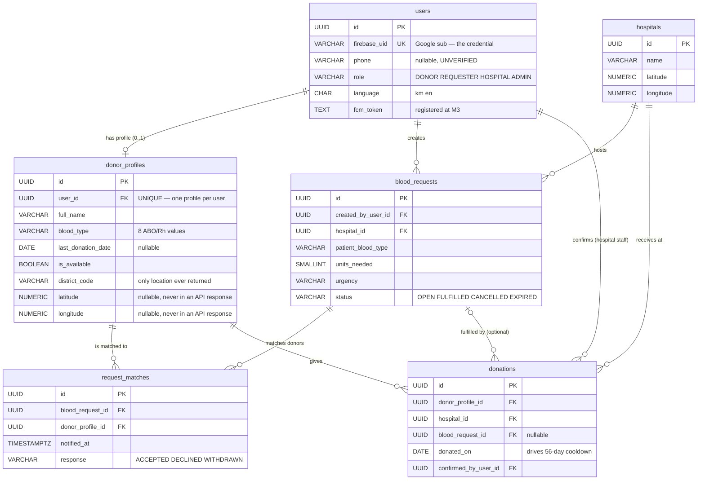

# Data Model — ERD (M1 deliverable)

The **column-level schema is not defined here.** It lives in
[`../fullstack/specs/foundation/backend-spring.md`](../fullstack/specs/foundation/backend-spring.md)
under "Initial schema — `V1__init.sql`", which Fullstack owns. This document is the architecture-level
view: entities, cardinality, and the decisions that shape them. Duplicating columns here would create
a second source of truth that goes stale the first time a migration lands.

## Entity relationship diagram

## Why the shape is this way

**`donor_profiles` is separate from `users`, not merged into it.** Requesters, hospital staff and
admins are users with no blood type, no availability and no cooldown. Merging would put six nullable
donor columns on every account and make "is this person a donor" a null check instead of a join.

**`request_matches` is a real table, not a computed list.** FR-NOTIFY-001 needs to know a push was
sent (`notified_at`), and FR-REQUEST-002 needs the donor's answer. Neither is derivable from the
request and the donor alone — the match is the thing that has state.

**`donations` is the sole source of truth for eligibility.** `donor_profiles.last_donation_date`
exists for fast filtering, but it is a cache of `MAX(donations.donated_on)`. If the two disagree, the
`donations` row wins. FR-DONOR-002's 56-day computation must not be able to disagree with the history
FR-DONATION-001 displays.

**`donations.blood_request_id` is nullable.** FR-08 allows a donation with no originating request —
someone who simply walks in. Making it required would make the app unable to record the most common
kind of donation.

**Primary keys are UUID.** Sequential IDs in API paths would let anyone enumerate donors and requests;
phone number plus blood type is exactly the data worth enumerating (`prd.md` §6).

## Amended 2026-08-07 by the auth change

`users.firebase_uid` replaces phone as the credential — see
[ADR 0002](adr/0002-auth-google-sign-in.md) and `SEC-REVIEW-001` finding F1. Consequences:

- Identity is the Google `sub` claim, written server-side from a verified ID token. Never from a
  request body.
- **`phone` is now unverified and nullable.** Anything that assumes a reachable number is wrong until
  `FR-REQUEST-002` moves coordination to FCM push.

## Open decisions that block the schema

| Decision | Blocks | Status |
|---|---|---|
| ~~Donor location precision~~ | — | **[ADR 0003](adr/0003-donor-location-precision.md) — accepted 2026-08-07.** `district_code` + coarse nullable coordinates that no API returns |
| ABO/Rh compatibility: lookup table vs code | The M4 matching query's shape | **[ADR 0004](adr/0004-abo-rh-compatibility-lookup-table.md) — accepted** |
| Request expiry rule | `blood_requests.status = 'EXPIRED'` is unreachable; no `expires_at` | open — no FR, no rule. Ships as a dead value at M2 |

## Not in the M2 schema

No spatial index — a computed ordering is fine at pilot size (ADR 0003). No metrics/event table (FR-GLOBAL-002, M3–M5 capture — needs
its own design). No admin provisioning path, so the first `ADMIN` must be seeded by migration; that
seeding is a privileged path and needs its own security review when written.
